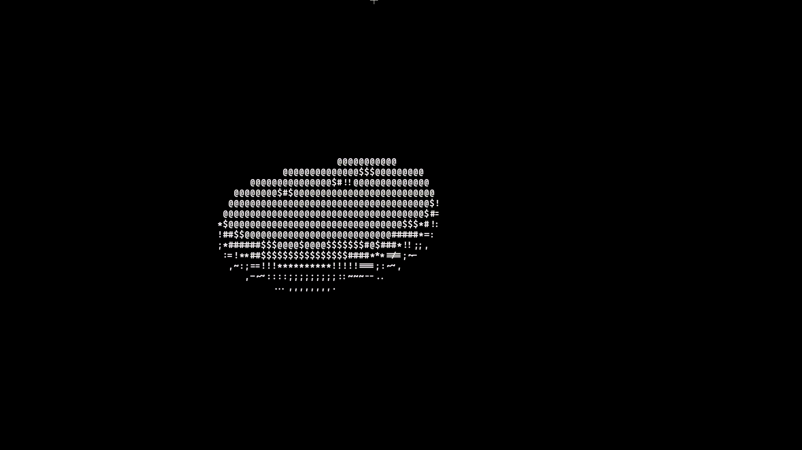

# D_ASCII_Donut_Renderer



## Overview

The **D_ASCII_Donut_Renderer** is a Python terminal-based project that renders a rotating 3D ASCII donut in real time.

It demonstrates core computer graphics principles without the use of external rendering engines or graphical libraries. The entire visualization is computed mathematically using 3D transformations, projection techniques, and lighting simulation, then displayed in the terminal using ASCII characters.

---

## Technical Summary

This project implements the following concepts:

- Parametric representation of a torus (3D donut shape)
- Continuous rotation in three-dimensional space
- Rotation matrices applied along multiple axes
- Perspective projection from 3D to 2D
- Depth buffering (Z-buffer) for correct rendering order
- Lighting calculation based on surface normals
- ASCII character mapping based on intensity values
- Frame-by-frame rendering for animation

---

## Rendering Pipeline

The animation is generated through a structured pipeline:

1. A torus is defined using parametric equations.
2. Each point on the surface is rotated over time.
3. The transformed coordinates are projected into 2D space.
4. A depth buffer is used to resolve visibility.
5. Lighting intensity is computed from surface orientation.
6. ASCII characters are selected based on brightness levels.
7. Frames are rendered sequentially to produce animation.

---

## Execution

### Requirements
- Python 3.x

### Generate animation

```bash
python donut_gif.py
